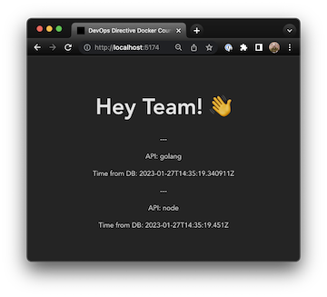
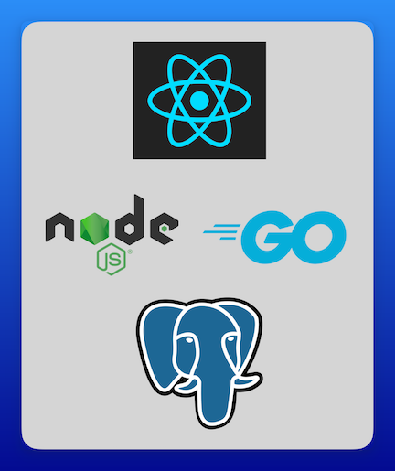

# Docker showcase web application

## Minimal 3 tier web application
- **React frontend:** Uses react query to load data from the two apis and display the result
- **Node JS API:** Do have `/` and `/ping` endpoints. `/` queries the Database for the current time, and `/ping` returns `pong`
- **Postgres Database:** An empty PostgreSQL database with no tables or data. Used to show how to set up connectivity. The API applications execute `SELECT NOW() as now;` to determine the current time to return.

## Running the Application

While the whole point of this app is that you probably won't want/need to run the application locally, we can do so as a starting point.

The `Makefile` contains the commands to start each application.

### Postgres

It's way more convenient to run postgres in a container, so we will do that.

`make run-postgres` will start postgres in a container and publish port 5432 from the container to your localhost.

### api-node

To run the node api you will need to run `npm install` to install the dependencies.

After installing the dependencies, `make run-api-node` will run the api in development mode with nodemon for restarting the app when you make source code changes.

### client-react

Like `api-node`, you will first need to install the dependencies with `npm install`

After installing the dependencies, `make run-client-react` will use vite to run the react app in development mode.